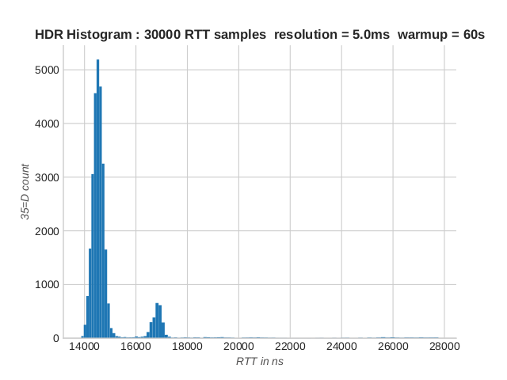
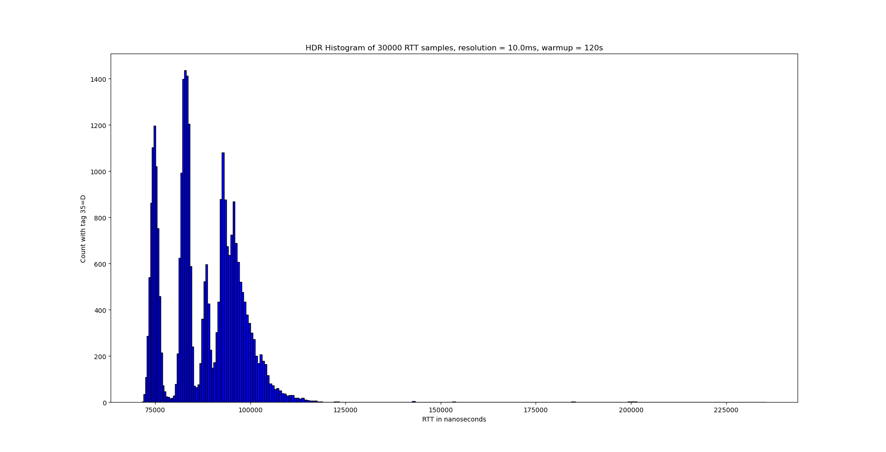

IdeaFIX vs Quickfix/J benchmarks
===========

Pre-requisites 

* JDK 21
* Gradle 8.0+
* Maven 2.6+
* Python 3 (for analysis)

Here are the included folders :

* ```ideafix_client``` the benchmark IdeaFIX client
* ```ideafix_server``` the benchmark IdeaFIX server
* ```quickfix_client``` the benchmark QuickFIX/J client
* ```quickfix_server``` the benchmark QuickFIX/J client
* ```analysis``` the python script analysing performances

As the focus of trading applications is on response times, this benchmark method 
involves writing a client that sends orders (NewSingleOrder type 35=D) and receives
2 executions reports (type 35=8), one acknowledgement and one file report.

After that, the client sends another order which then triggers 2 execution report and so on 
until the timer is expired. 

It's a simple but realistic ping-pong setup that is very suitable for end-to-end latency measurement.
It allows for a platform-neutral, generic comparison between FIX engines.

Analysing message history leads to a measure of the distribution of round trip times (RTT).
This includes mean, standard deviation, percentiles etc.

For the moment, only IdeaFIX and QuickFIX/J are listed, which means there are 4 FIX 
Applications, 2 clients and 2 servers.

to run a benchmark of IdeaFIX for the default period (10 min), run command :

```./ideafix_bench.sh```

To run the benchmark for only 1m :

```./ideafix_bench.sh -d 60```

similarly you can run  :

```./quickfix_bench.sh```

or :

```./quickfix_bench.sh 60```

Note IdeaFIX runs best on server specs with several cores available as it's using
more parallelism than QuickFIX/J. Also generating a high-frequency message history
can be demanding for the hard drive. It's best to have a NVMe SSD model with lots of
space available. Be careful with long benchmark runs !

The analysis requires python 3+. the script can be found in the analysis folder :

```
./analyse_message_history.py --help
usage: analyse_message_history.py [-h] [--resolution RESOLUTION] [--sampleCount SAMPLECOUNT] [--warmup WARMUP] [--tag TAG] [--useHeaderTimestamp | --no-useHeaderTimestamp] filename

compute RTT by resampling message history. provide a HDR histogram and percentiles thanks to a bootstrap method.

positional arguments:
  filename              message history to process

options:
  -h, --help            show this help message and exit
  --resolution RESOLUTION
                        define the sampling resolution in nanoseconds (default is 10000000ns = 10ms)
  --sampleCount SAMPLECOUNT
                        define the number of samples, higher means better estimates (default is 10000)
  --warmup WARMUP       define the warmup period to ignore during sampling (default is 30s)
  --tag TAG             defines the tag to look for (default is 35=D)
  --useHeaderTimestamp, --no-useHeaderTimestamp
                        use header timestamp (a long number before separator ';', faster and more precise)

```

for example, the following command :

```
./analyse_message_history.py 
/mnt/data/ideafix_bench/ideafix_data/ideafix_client/IdeaFixClientBenchmark_INITIATOR_FIX.4.4_clientBenchmark_serverBenchmark_SIMPLE_OM.xml/20240416-00_00-23_59_59@Europe_Paris/outgoing/outgoing_session.1.fix 
--useHeaderTimestamp --warmup 240 --sampleCount 30000
```

gave the following results on my testing hardware :

```
population mean = 15231.44 ns
sampled mean = 15774.40 ns
std dev. = 13820.78 ns
sample size = 365
Percentiles:
	1.00th percentile = 14070.36 ns
	5.00th percentile = 14200.56 ns
	50.00th percentile = 14558.12 ns
	90.00th percentile = 16723.15 ns
	95.00th percentile = 17019.77 ns
	99.00th percentile = 31322.83 ns
	99.90th percentile = 273305.86 ns
	99.99th percentile = 491278.72 ns
```



Results are excellent ! RTT distribution is also very smooth and centered, which means RTTs are predictable.

In fact, a major part of time is spent on the OS network stack. 
To measure local TCP RTT, [tcpping](https://github.com/josephcolton/tcpping) 
is very helpful.

On my testing hardware this gives  (30s warmup, 300s total run time) :

```
./tcpping localhost -s 30 -c 300 -d stat
TCP PING localhost (127.0.0.1) tcp port 443
--- localhost tcp ping statistics ---
270 pings, 270 success, 0 failed, 0.0% loss, total run time: 299101.532 ms
rtt min/ave/max/range/jitter = 0.031/0.032/0.045/0.014/0.001 ms

```

IdeaFIX is under 30µs that is **less** than plain tcpping RTT.
It can be surprising at first but this is due the choice of (optimised) 
socket parameters in IdeaFIX

Nevertheless, this gives an indication that IdeaFIX is very close to the 
raw performance of the default linux network stack. Only a handful of microseconds
is spent parsing and marshalling FIX messages. 

The hardware and OS used is (```uname -a``` & ```hwinfo -short```) :

```
Clear Linux **** 6.8.2-1420.native #1 SMP Tue Mar 26 22:42:57 PDT 2024 x86_64 GNU/Linux
memory         128KiB L1 cache
memory         128KiB L1 cache
memory         1MiB L2 cache
memory         8MiB L3 cache
processor      8 * Intel(R) Core(TM) i7-6700 CPU @ 3.40GHz
memory         32GiB System Memory
memory         8GiB DIMM DDR4 Synchronous 2133 MHz (0.5 ns)
memory         8GiB DIMM DDR4 Synchronous 2133 MHz (0.5 ns)
memory         8GiB DIMM DDR4 Synchronous 2133 MHz (0.5 ns)
memory         8GiB DIMM DDR4 Synchronous 2133 MHz (0.5 ns)
bridge         Xeon E3-1200 v5/E3-1500 v5/6th Gen Core Processor Host Bridge/DRAM Registers
bridge         6th-10th Gen Core Processor PCIe Controller (x16)
storage        PC300 NVMe SK hynix 256GB
```

For comparison, here are Quickfix/J results on the same hardware :



```
population mean = 86687.05 ns
sampled mean = 87259.58 ns
sample size = 133
Percentiles:
	50.00th percentile = 85144.16 ns
	90.00th percentile = 98814.27 ns
	95.00th percentile = 101801.64 ns
	99.00th percentile = 108498.62 ns
	99.90th percentile = 139655.51 ns
	99.99th percentile = 235507.04 ns
```

IdeaFIX is more than 5x faster !
